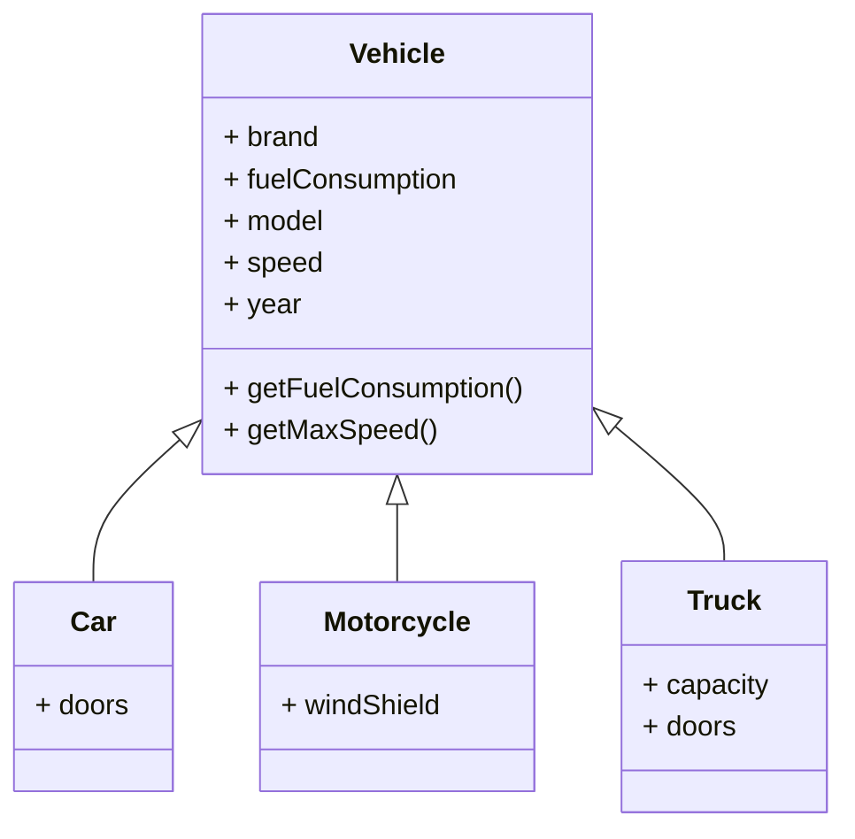

# Enskild inlämningsuppgift - Trip to Destination

## Innehåll

- [1. Inledning](#1-inledning)
    - [1.1 Bakgrund](#11-bakgrund)
    - [1.2 Frågeställningen](#12-frågeställningen)
  - [1.3 Avgränsning](#13-avgränsning)
      - [1.3.1 Ni ska använda](#131-ni-ska-använda)
      - [1.3.2 Ni får använda](#132-ni-får-använda)
      - [1.3.3 Dvs inga](#133-dvs-inga)
      - [1.3.4 Frivilligt](#134-frivilligt)
  - [1.4 Mål](#14-mål)
    - [1.5 Syfte](#15-syfte)
    - [1.6 Vad ska ni leverera?](#16-vad-ska-ni-leverera)
- [2. Projekt Uppgift](#2-projekt-uppgift)
    - [2.1 Uppgift](#21-uppgift)
    - [2.2 Funktioner som ska finnas för Godkänt samt Väl Godkänt](#22-funktioner-som-ska-finnas-för-godkänt-samt-väl-godkänt)
        - [2.2.1 Instruktioner](#221-instruktioner)
        - [2.2.2 Klass diagram](#222-klass-diagram)
        - [2.2.3 Exempeldata](#223-exempeldata)
- [3. Betygskrav](#3-betygskrav)
    - [3.1 Grundläggande Krav](#31-grundläggande-krav)
        - [3.1.1 Funktionalitet](#311-funktionalitet)
        - [3.1.2 Dokumentation i mappen documents för projektet](#312-dokumentation-för-projektet)
        - [3.1.3 Personliga reflektioner](#313-dokumentation-för-personliga-reflektioner)
- [4. Sista inlämningstid](#4-sista-inlämningstid)

## 1. Inledning

### 1.1 Bakgrund

Ni är nu i slutet på kursen Objektorienterad programmering och har lärt er att skapa objekt och klasser. Ni har även
lärt er att skapa och använda er av olika typer av metoder. Nu är det dags att sätta ihop allt ni lärt er och skapa en
applikation som kan hantera en kalkylator för att beräkna den billigaste resan mellan två platser.

### 1.2 Frågeställningen

Hur kan vi skapa en applikation som kan kalkylera vilket fordon som är billigast att använda för en resa från Göteborg
till Malmö?

### 1.3 Avgränsning

#### 1.3.1 Ni ska använda:

- Java OpenJDK 17 LTS

#### 1.3.2 Ni får använda:

- IntelliJ IDEA
- Visual Studio Code

#### 1.3.3 Dvs inga:

- Inga andra språk än Java
- Inga former av paket som inte är standard i Java

#### 1.3.4 Frivilligt

- Utökad Fordonsinformation: Till exempel motortyp, bränsletyp eller andra specifika tekniska detaljer
  som kan vara intressanta att jämföra.
- Ruttplanering: Möjlighet att beräkna den totala kostnaden för en rutt som innefattar flera stopp eller vägval baserat
  på trafik, vägtullar etc.
- Realtidsdata Integration: Integrering med realtidsdata för bränslepriser, trafikinformation eller väderförhållanden
  som kan påverka resan.
- Anpassade Beräkningar: Möjlighet för användaren att definiera egna kriterier och värderingar för att anpassa
  beräkningarna, som skatt, försäkring eller underhållskostnader.
- Grafiska Representationer: Visa resultaten genom grafer eller diagram för en mer visuell jämförelse.

_**Om ni väljer att implementera någon av dessa funktioner, så ska grundprogrammet med dess funktionalitet fortfarande
fungera som avsett.**_

### 1.4 Mål

Din uppgift är att skapa en kalkylator applikation som kan beräkna den billigaste resan. Applikationen ska kunna skriva
ut följande information om varje objekt:

* Märke och modell på fordonet
* År då fordonet tillverkades
* Högsta hastighet och bränsleförbrukning på fordonet

### 1.5 Syfte

Utveckla en applikation som hjälper resenärer och transportörer att snabbt och exakt beräkna och jämföra
kostnaderna för olika transportalternativ mellan två platser, som exempelvis Göteborg och Malmö.

### 1.6 Vad ska ni leverera?

En Kalkylator applikation som kan:

Förväntad funktionalitet:

Jämför 3 fordon och skriv resultatet ut till konsolen:

### Output Exempel

```text
Avstånd att resa: 200 km
Bränslepris: 19,42 kr/l

Toyota Camry (2018)
Maxhastighet: 220 km/h
Bränsleförbrukning: 7,5 l/100 km
Antal dörrar: 4
Resans längd: 200 km
Bränslebehov: 15,0 l
Pris: 292,10 kr

Harley-Davidson Sportster (2019)
Maxhastighet: 200 km/h
Bränsleförbrukning: 5,0 l/100 km
Har vindruta: nej
Resans längd: 200 km
Bränslebehov: 10,0 l
Pris: 194,20 kr

Scania R450 (2015)
Maxhastighet: 90 km/h
Bränsleförbrukning: 35,0 l/100 km
Antal dörrar: 2
Kapacitet: 40 ton
Resans längd: 200 km
Bränslebehov: 70,0 l
Pris: 1360,40 kr

Harley-Davidson Sportster (2019) är billigast, den kostar endast 194,20 kronor per sträcka.
```

## 2. Projekt Uppgift

### 2.1 Uppgift

Skapa en "Resan till Malmö" kalkylator applikation som kan beräkna det billigaste rese alternativet.

### 2.2 Funktioner som ska finnas för Godkänt samt Väl Godkänt

#### 2.2.1 Instruktioner

<table>
	<tr>
		<th>Område</th>
		<th>G-nivå</th>
		<th>VG-nivå</th>
	</tr>
    <tr>
        <td>Klass namn</td>
        <td>Följer standard Java-namngivningskonventioner</td>
        <td>Optimerad och beskrivande namngivning som förbättrar läsbarhet</td>
    </tr>
	<tr>
		<td>Bränsleförbrukning</td>
        <td>Kan beräkna bränsleförbrukning per sträcka</td>
        <td>Kan beräkna bränsleförbrukning för olika hastigheter per sträcka</td>
	</tr>
	<tr>
		<td>Fönster och Dörrar</td>
        <td><em>Behöver ej skrivas ut för godkänt</em></td>
        <td>Ger grundläggande information om antal fönster och dörrar</td>
	</tr>
	<tr>
		<td>Kapacitet</td>
        <td><em>Behöver ej skrivas ut för godkänt</em></td>
        <td>Visar grundläggande kapacitetsinformation som passagerarantal</td>
	</tr>
	<tr>
		<td>Användargränssnitt</td>
        <td>Skriver ut resultatet till konsolen för 3 fordon</td>
        <td>Har ett funktionellt interaktivt gränssnitt</td>
	</tr>
</table>

1. Skapa en abstrakt klass `Vehicle` med följande egenskaper:

    - `brand` (String): märket på fordonet
    - `model` (String): modellen på fordonet
    - `speed` (int): den högsta hastigheten fordonet kan nå
    - `year` (int): året då fordonet tillverkades
    - `getFuelConsumption()` (float): en abstrakt metod som returnerar fordonets bränsleförbrukning i liter per 100 km
    - `getMaxSpeed()` (int): en abstrakt metod som returnerar fordonets högsta hastighet i km/h

2. Skapa tre subklasser till `Vehicle`: `Car`, `Truck` och `Motorcycle`.

    - `Car` ska ha en egenskap `doors` (int) som anger antalet dörrar på bilen.
    - `Motorcycle` ska ha en egenskap `windShield` (boolean) som indikerar om motorcykeln har en vindruta eller inte.
    - `Truck` ska också ha egenskapen `doors` (int) men även `capacity` (int) och som anger lastkapaciteten i ton.

3. Implementera metoderna `getFuelConsumption()` och `getMaxSpeed()` i varje subklass baserat på dess egenskaper.

#### 2.2.2 Klass diagram



Skriv en Java-applikation som använder klasserna `Vehicle`, `Car`, `Motorcycle` och `Truck` för att skapa instanser av
olika fordon och testa deras egenskaper och metoder. Skapa minst ett objekt av varje subklass och skriv ut följande
information om varje objekt:

- Märke och modell på fordonet
- År då fordonet tillverkades
- Högsta hastighet och bränsleförbrukning på fordonet
- Antal dörrar på fordonet (om det är en bil)
- Om fordonet har en vindruta eller inte (om det är en motorcykel)
- Lastkapaciteten på fordonet (om det är en lastbil)

#### 2.2.3 Exempeldata

Använd gärna följande exempel på bränsleförbrukning och modeller i tabellform:

| Typ        | Märke           | Modell       | Bränsleförbrukning (l/100 km) |
|------------|-----------------|--------------|-------------------------------|
| Car        | BMW             | M5           | 10.0                          |
| Car        | Ford            | Mustang      | 11.5                          |
| Car        | Honda           | Civic        | 6.5                           |
| Car        | Tesla           | Model S      | electric (0)                  |
| Car        | Toyota          | Camry        | 7.5                           |
| Car        | Volvo           | S90          | 8.0                           |
| Motorcycle | BMW             | R 1200 GS    | 4.5                           |
| Motorcycle | Ducati          | Panigale V4  | 6.5                           |
| Motorcycle | Harley-Davidson | Sportster    | 5.0                           |
| Motorcycle | Kawasaki        | Ninja ZX-10R | 6.0                           |
| Motorcycle | Suzuki          | GSX-R1000    | 7.0                           |
| Motorcycle | Yamaha          | MT-07        | 4.5                           |
| Truck      | DAF             | XF           | 30.0                          |
| Truck      | Iveco           | Stralis      | 34.0                          |
| Truck      | MAN             | TGX          | 32.0                          |
| Truck      | Mercedes-Benz   | Actros       | 36.0                          |
| Truck      | Scania          | R450         | 35.0                          |
| Truck      | Volvo           | FH16         | 33.0                          |

## 3. Betygskrav

#### Projektet skall fungera som avsett av utbildaren, vid oklarheter fråga!

_Möts inte detta kriteriet så är man underkänd per automatik!_

Ingen tid kommer att läggas på er inlämning och er inlämning kommer **inte** rättas alls om den inte är komplett!

Det vill säga, att om er applikation inte uppfyller alla krav så kommer er inlämning inte att bli rättad och ni får
således inte heller någon feedback!

### 3.1 Grundläggande Krav

- [ ] Komplett `pom.xml` fil som bygger projektet.
- [ ] Klasskamrat ska verifiera att er inlämning möter kraven innan ni lämnar in. Ni namnger vem som godkänt er
  inlämning i er `personal_reflections.md` fil.
- [ ] Förbereda en max 5 min redovisning på vad ni gjort och hur ni gjort det. Ni ska kunna svara på frågor om er
  inlämning. Powerpoint eller liknande är inte ett krav.

**Projektstruktur:**

```text
├───documentation
│       personal_reflections.md
├───src
│   ├───main
│   │   ├───java
│   │   │   └───se
│   │   │       └───dsve
│   │   │               Car.java
│   │   │               Main.java
│   │   │               Motorcycle.java
│   │   │               Truck.java
│   │   │               Vehicle.java
│   │   └───resources
│   └───test
│       └───java
│           └───se
│               └───dsve
│                       CarTest.java
│                       MainTest.java
│                       MotorcycleTest.java
│                       TruckTest.java
│                       VehicleTest.java
├── .gitignore
├── pom.xml
├── ProjectSubmission.md
└── README.md
```

#### 3.1.1 Funktionalitet

<table>
	<tr>
		<th>Område</th>
		<th>G-nivå</th>
		<th>VG-nivå</th>
	</tr>
    <tr>
        <td>Planering</td>
        <td>Enklare projektplan</td>
        <td>Upprätta en genomarbetad projektplan som revideras vid behov</td>
    </tr>
    <tr>
        <td>Kod stil</td>
        <td>Lättläst kod med kommentarer om nödvändigt</td>
        <td>Skriv så tydlig kod så kommentarer ofta blir onödiga. Där du använder kommentarer ska de <strong><em>noggranna och utförliga/tydliga</em></strong></td>
    </tr>
    <tr>
        <td>Läsbarhet</td>
        <td><strong>Lättläst kod.</strong></td>
        <td><strong>Väldigt lättläst kod</strong> dvs någon med kunskaper motsvarande den nivå ni befinner er på nu, ska kunna läsa och förstå er kod.</td>
    </tr>
    <tr>
        <td>Struktur</td>
        <td>Tydlig namngivning av variabler och funktioner</td>
        <td>Majoriteten av din kod ska bestå av strukturerade komponenter samt återanvända komponenter. Arbeta enligt <strong>DRY-principen</strong> (Do Not Repeat you’re self)</td>
    </tr>
    <tr>
        <td>Kontroll</td>
        <td>Gör en enklare kontroll så att dina funktioner fungerar som de ska.</td>
        <td>Kontrollera att dina funktioner inte har sidoeffekter, dvs se till så att det inte finns uppenbara programlogiska fel.</td>
    </tr>
</table>

#### 3.1.2 Dokumentation för projektet.

<table>
	<tr>
		<th>Fil</th>
		<th>G-nivå</th>
	</tr>
    <tr>
        <td>README.md</td>
        <td>
            <ul>
                <li>Hur man driftar hela projektet</li>
                <li>Hur man startar/stoppar de olika delarna</li>
                <li>Allt som behövs för att vem som helst ska kunna starta projektet på sin dator</li>
                <li>Använd korrekta begrepp och syntax i dina beskrivningar.</li>
            </ul>
        </td>
    </tr>
</table>

#### 3.1.3 Dokumentation för personliga reflektioner

<table>
	<tr>
		<th>Område</th>
		<th>G-nivå</th>
		<th>VG-nivå</th>
	</tr>
    <tr>
        <td>personal_reflections.md</td>
        <td>
            <ul>
                <li>Fyll i under alla rubriker fram till VG</li>
                <li>2-3 meningar per rubrik!</li>
            </ul>
        </td>
        <td>
            <ul>
                <li>Fyll även i rubrikerna under VG</li>
                <li><strong>3 -5 meningar per rubrik</strong>, detta gäller bara under VG-delen</li>
            </ul>
        </td>
    </tr>
</table>

_För att få **VG** på uppgiften ska du även fylla i VG delen i dokumentet._

Detta innebär:

1. `README.md`-fil i projektets rotmapp.
2. `personal_reflections.md`-fil i mappen `documents`

## 4. Sista inlämningstid

Lämna in uppgiften via GitHub-länk senast den `datum` kl. `tid`.

* Fram till deadline kan ni få VG på er inlämning.
* Efter deadline kan ni endast få G på er inlämning.
* Om ni inte lämnar in något alls får ni IG på er inlämning.
* Ni kan komplettera er inlämning fram till `slutdatum` därefter kan ni inte komplettera er inlämning.

Frågor? Återkom till utbildaren via Google Meet/Teams/Discord eller maila mig på `mail`.

_OBS! Är det frågor som fler än du själv har nytt av att få svar på, använd er av Discord kanalen för frågor och svar._
