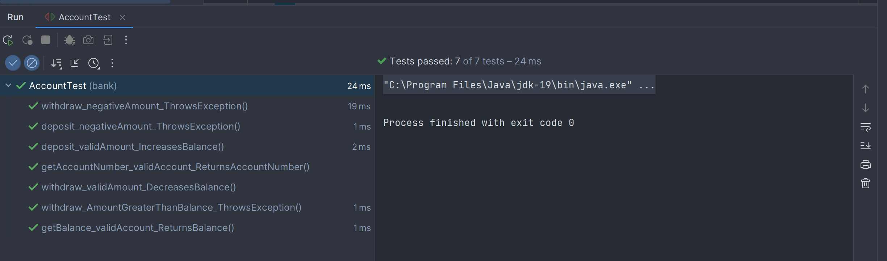

# Aram

## Projektrapport: TDD Bankkonto

### Beskrivning av projektet

Projektet handlar om att implementera en Account-klass för ett bankkonto med hjälp av TDD (Test-Driven Development). Syftet är att säkerställa att koden fungerar korrekt genom att skriva testerna först och sedan implementera funktionaliteten. Klassen möjliggör hantering av insättningar, uttag och saldo för bankkonton.

### Planering

Jag planerade efter uppgiften som vi fick av Marcus. Det var en enkel projekt det som syftet var testningen. Jag började med att strukturera mig och börja starta projektet med Maven och använde 
[org.junit.jupiter:junit-jupiter-engine:5.9.3] därefter skapade jag klasserna och sedan med (Ctrl+shift+T) skapade jag testet och började med teststrukturer. Det var lite bökigt i börja då det var länge sedan jag höll på med tester och det är absolut inte min starka sida heller. Men det löste sig till slut. 

### Utveckling

Utvecklingen är lite svår när man inte trycker om testning så mycket men det har varit roligt och ge sig ut på saker som är lite utmanande. Men det är frustrerande när den inte fungerar. Jag är en person som tycker om att se resultat ganska snabbt. Jag tror att testning kommer att vara min nya grej.

### Datatyper

- Double: använde jag för att lagra saldot på kontot
- String: använde jag för att lagra kontonummret

### Vem gjorde vad

Jag har skapat hela mitt projekt. Men jag har använt mig av ChatGPT för att förstå vad dessa grejer gör:
`import org.junit.jupiter.api.BeforeEach;`
`import org.junit.jupiter.api.Assertions;`
Och jag har tagit hjälp av Marcus föreläsningar under veckan och det såg jätte enkelt ut när han gjorde det.

### Vad kunde ha gjorts bättre

Det finns säkert mycket man kan göra då jag inte har så mycket erfarenhet av testning, men jag vet inte om det finns andra sätt att testa sin kod. Det hade varit kul om man fick andra sätt som är enklare kanske. Man vill alltid något nytt och lätt.

### Slutsatser
I detta TDD-projekt har jag framgångsrikt skapat ett system för att hantera bankkonton. Genom att använda JUnit-tester har jag säkerställt att min kod fungerar korrekt.

Genom detta projekt har jag lärt mig vikten av att planera och strukturera mina tester för att täcka olika användningsfall och gränssituationer.

För att förbättra mitt arbete i framtiden kan jag skapa mer omfattande testfall och förbättra min kodstruktur och namngivning.

Sammanfattningsvis har jag lärt mig vikten av testning och TDD i utvecklingsprocessen och kan fortsätta förbättra mina programmeringsfärdigheter genom att tillämpa dessa principer och lärdomar.

### Backlog
Jag gjorde ingen backlog då projektet var så litet och inte krävde så avancerade delar.

### Beskriv lite olika lösningar du gjort
Lösningar att jag skapade en vanlig Java och IntelliJ som Build System, men jag insåg att jag inte fick med det jag hade sett på föreläsningen av Marcus. Jag ville testa det utan Maven och frågade även klasskamrater som hade kört utan Maven. Jag hade svårt och köra på samma sett då jag hade sett Marcus visat det enkelt vägen på föreläsningen. Då vände jag mig om och körde på samma sätt som Marcus.

### Beskriv något som var besvärligt att få till
Att få testarna fungera var ganska besvärligt då jag hade den här lilla som fick hela min kod att krascha `[ if (initialBalance > 0) ]` jag hoppas att du kan se felet.

Det som var också besvärligt var att försöka att ge sig på något man inte har lärt sig och försöka forska och hitta andra lösningar. Till slut gick  jag tillbaka till den lätta vägen som Marcus hade visat.

### Beskriv om du fått byta lösning och varför i sådana fall
Jag har inte behövt byta något.

### Vad gick bra
Att skriva testet gick väldigt bra, jag blev väldigt imponerad på mig själv där.

### Vad gick dåligt
Jag tror inte att något gick dåligt. Allt kändes väldigt clean.

### Vad har du lärt dig
Jag har lärt mig att använda JUnit-tester. Jag har haft tidigare erfarenheter av tester men den här var nytt och roligt.

### Vilka möjligheter ser du med de kunskaper du fått under kursen
Jag skulle kunna bli en testare nu när jag ser det är så kul med resultaten, men hellre programmera.

