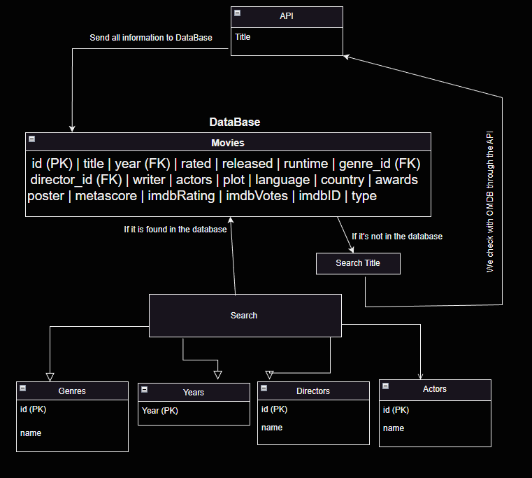

<h1>Aram</h1>

[Trello planering](https://trello.com/b/q8XlSXZp/movies-db)

<h2> Projektrapport: Movies Database </h2>
Projektrapport: Vårt projekt innefattade att skapa en databas för filmsökning, 
där användaren kan söka efter filmer baserat på titel, skådespelare, regissör eller genre. 
Vi planerade att använda SQLite som databashanterare och OMDb API för att hämta 
filminformation. Projektet skulle följa objektorienterad programmering (OOP) principer. 
Användaren söker först i vår databas efter en film; om den inte finns där, söker vi i 
OMDb API med filmens titel. Vi hämtar sedan filmen och dess information och lägger 
till den i vår databas.

<h3> Beskrivning av Planering </h3>
Planeringsprocess:
Vi valde att använda Trello som vårt planeringsverktyg och följde Scrum-metodiken. 
Under dagar med lektioner hade vi dagliga möten kl. 11:45, medan vi på andra dagar höll möten kl.
09:00. Dessa möten varade i cirka 15 minuter. Efter planeringen arbetade vi individuellt
med kodning och återkopplade gemensamt kl. 13:00 för att diskutera och samordna vårt arbete.

<h3> Utveckling </h3>
Under utvecklingsfasen följde vi vår planering och arbetsfördelning. 
Vi började med att skapa de grundläggande klasserna och fokuserade på att implementera 
film-databasens grundfunktionalitet. Efter att ha etablerat grunden för projektet, 
arbetade vi på att förbättra och lägga till mer avancerade funktioner och sökmekanismer. 
Vi använde oss av versionhanteringssystemet Git för att effektivt samarbeta och hålla 
koll på våra ändringar. Regelbundna möten och kommunikation mellan teammedlemmarna underlättade 
utvecklingen och hjälpte oss att lösa problem och förstå varandras arbete.

<h3> Datatyper </h3>

Main-klassen:Ingen särskild datatyp används här.

Menu-klassen:
SQlite db: En instans av SQlite-klassen som hanterar databasoperationer.
APIkey apIkey: En instans av APIkey-klassen som hanterar API-nyckeln och kommunikation med omdbapi.com.

Movie-klassen:
String title, year, actors, director, Genre: Strängar som representerar filmens attribut.

APIkey-klassen:String key: 
Strängen som lagrar API-nyckeln.
Movie movie1: En instans av Movie-klassen som lagrar filmdata som hämtats från omdbapi.com.

MovieBuilder-klassen:
String title, year, actors, director, Genre: Strängar som representerar filmens attribut.

SQlite-klassen:Connection conn: 
En anslutning till databasen.
String databaseName: Namnet på databasen. 
String userInput: Användarens input för filmsökning.

<h3> Vem gjorde vad: </h3>

Aram: Skapade Menu-klassen och diagrammet.

Samer: Gjorde MovieBuilder-klassen och SQlite-klassen.

Robin: Skapade APIkey-klassen och Movie-klassen.

Alla har också samarbetat och hjälpt varandra för att få deras respektive klasser att fungera tillsammans 
och lösa problem som uppstod under utvecklingsprocessen.

<h3> Vad kunde ha gjorts bättre: </h3>

Samarbetet: 
Även om samarbetet har varit bra, kan det alltid bli bättre. Försök att hålla regelbundna möten, 
diskutera problem och dela idéer för att förbättra kommunikationen och 
arbetsflödet i teamet.

Github-användning: 
Fortsätt att öva på att använda Github i grupp för att bli mer bekväm med det och förbättra samarbetsaspekterna
i projektet. Lär dig om branches, pull requests och att hantera konflikter för att underlätta samarbete och koddelning.

Planering: 
Att ha en tydlig och detaljerad plan innan projektet påbörjas är viktigt. Försök att gräva djupare och definiera 
exakt vad som behövs i projektet innan du börjar koda. Detta kan minska risken för att stöta på oväntade problem 
eller behovet av att ändra koden i mitten eller slutet av projektet.

Anpassningsförmåga: 
Var beredd på att ändra kurs om det behövs. 
Om du stöter på problem eller nya krav under projektet, 
var flexibel och anpassa er plan för att möta dessa nya behov.

<h3> Slutsatser: </h3>
I detta projekt har vi framgångsrikt skapat ett system för att hantera och organisera filmer. 
Genom att samarbeta som ett team och dela upp arbetsuppgifterna kunde vi effektivt bygga systemet 
och dess funktioner. Under projektets gång stötte vi på flera utmaningar, men vi lärde oss vikten av god kommunikation,
planering och problemlösning. Vi har också fått erfarenhet av att arbeta med tekniker som API-nycklar ochSQLite databaser.

Genom att reflektera över vad vi kunde ha gjort bättre, till exempel förbättring av samarbetet, 
mer effektiv användning av Github, bättre planering och anpassningsförmåga, 
kan vi använda dessa lärdomar i framtida projekt för att fortsätta förbättra våra färdigheter och arbetssätt som ett team.

<h3> Backlog </h3>
Övergripande:

1. Skapa grundläggande klasser för projektet:
    a. Skapa Menu-, Movie-, MovieBuilder- och APIKey-klasser
    b. Definiera och enas om variabler och deras placering
    c. Förenkla och förtydliga klassernas struktur

2. Testa alla klasser tillsammans:
    a. Implementera en testapplikation som använder alla skapade klasser
    b. Åtgärda eventuella kopplingsproblem mellan klasser
    c. Kontrollera att alla skapade klasser fungerar som förväntat

3. Implementera SQLite-databasen:
    a. Skapa och konfigurera SQLite-databasen för att lagra och hantera filmdata
    b. Lägg till funktioner för att lägga till, uppdatera och ta bort filmer i databasen
    c. Testa databasens funktionalitet och koppla den till de andra klasserna i projektet

4. Skapa användargränssnittet:
    a. Designa och implementera användargränssnittet för applikationen
    b. Koppla användargränssnittet till de andra klasserna i projektet
    c. Testa och justera användargränssnittet för att säkerställa användarvänlighet och funktionalitet

<h4> Utförligare backlog: </h4>
Aram:
Skapade Menu-klassen, som hanterar navigering och interaktioner i applikationens meny. 
Dessutom skapade jag diagrammet för att visualisera och presentera filmdata på ett mer lättförståeligt sätt. 
Jag ansvarade också för att skapa en projektrapport som dokumenterade teamets framsteg och beslut under projektets gång.

Samer:
Utvecklade MovieBuilder-klassen, som är grundläggande för att bygga och hantera filmobjekt i applikationen.
Han skapade också klassen för att hantera SQLite-databasen, som används för att lagra och hantera filmdata på ett
strukturerat och effektivt sätt. Samer ansvarade för att implementera och testa databasfunktionaliteten och säkerställa
att den fungerade tillsammans med de andra klasserna i projektet.

Robin:
Skapade klassen för att hantera API-nycklar, som möjliggör för applikationen att hämta filmdata från externa källor.
Han utvecklade även Movie-klassen, som beskriver de olika filmerna som användaren kan lägga till,
söka och organisera i applikationen. Robin kopplade ihop alla komponenter, inklusive de klasser som utvecklats av mig och Samer,
och såg till att de fungerade tillsammans på ett korrekt och effektivt sätt.
Robin optimerade även koden för att förbättra applikationens prestanda och minska eventuella fel eller buggar.

---------------------------------------------------------------------------

<h3>Beskriv lite olika lösningar du gjort.</h3>

I det här projektet har jag stött på några utmaningar som jag har arbetat för att lösa. 
Ett sådant problem var med sökfunktionen i applikationen. Ursprungligen hade jag skapat en sökfunktion som direkt 
sökte efter filmens titel via API:et till OMDB. Men vi insåg att det skulle vara bättre att först söka i databasen 
innan vi använde API:et, eftersom filmen kanske redan finns i databasen.

För att lösa detta problem ändrade jag sökfunktionen så att den först söker i SQLite-databasen. 
Om filmen hittas i databasen returneras filmdata direkt från databasen. Om filmen inte hittas i databasen fortsätter 
sökfunktionen med att söka efter filmens titel via API:et till OMDB. På så sätt kunde vi optimera sökfunktionen och 
minska antalet API-anrop, vilket gör applikationen snabbare och mer effektiv.

Denna lösning innebar att jag behövde ändra sökfunktionens kod och säkerställa att den korrekt interagerade 
med både databasen och API:et. Genom att lösa detta problem har jag förbättrat applikationens funktionalitet 
och fått ytterligare erfarenhet av att arbeta med databaser och API:er.

<h3>Beskriv något som var besvärligt att få till.</h3>
Något som var besvärligt att få till under projektets gång var, 
som jag nämnde tidigare, sökfunktionen som krävde att vi först sökte i databasen innan vi använde API:et. 
Det var en utmaning att ändra sökfunktionens kod och säkerställa att den fungerade korrekt med både databasen och API:et. 
Men genom att arbeta med detta problem har jag förbättrat applikationens funktionalitet och fått ytterligare erfarenhet 
av att arbeta med databaser och API:er.

En annan utmaning vi stött på under projektet var att använda Github effektivt för att samarbeta som ett team. 
Vi hade vissa svårigheter med att hantera git push och branch ändringar, vilket ibland skapade problem och 
begränsade vår förmåga att koda fritt.

För att hantera dessa utmaningar har vi försökt att göra Github-processen enklare och mer strömlinjeformad för teamet. 
Vi har arbetat för att bli mer bekanta med Github och dess funktioner, så att vi kan använda det effektivt för att 
samarbeta och dela kod. Genom att förbättra vår användning av Github kan vi också förbättra vårt samarbete och effektivitet som ett team.

<h3>Beskriv om du fått byta lösning och varför i sådana fall.</h3>

<h3>Vad gick bra</h3>
I projektet ändrade jag sökfunktionen för att först söka i den lokala databasen och sedan i API:et om filmen inte fanns i databasen. 
Detta gjorde sökfunktionen effektivare och mer heltäckande, samtidigt som vi kunde utnyttja både databasen och API:et bättre.

<h3>Vad gick dåligt</h3>
Ett problem som uppstod under projektet var hanteringen av Github. 
Med flera grenar, pushar och sammanfogningar blev det svårt att hålla koll på alla ändringar och versioner av koden. 
Detta ledde till förvirring och ökade risken för att felaktiga versioner av koden kunde smyga sig in i projektet.

<h3>Vad har du lärt dig</h3>
Under projektets gång har jag lärt mig att arbeta med externa databaser och API:er. 
Även om jag tidigare har byggt egna databaser och använt mig av egna API:er, 
var det en ny och lärorik erfarenhet att använda en annan databas och hämta data från en extern källa. 
Denna kunskap kommer att vara användbar i framtida projekt där integration med tredjepartstjänster kan krävas.

<h3>Vilka möjligheter ser du med de kunskaper du fått under kursen.</h3>
De kunskaper jag har fått under kursen ger mig flera möjligheter för framtida projekt och arbete. 
Att kunna skapa och använda diagram ger mig förmågan att presentera och visualisera data på ett effektivt och lättförståeligt sätt. 
Att arbeta med SQLite ger mig erfarenhet av att använda lättviktiga databaser som är väl lämpade för små till medelstora applikationer. 
Dessutom, genom att lära mig att använda andras databaser med en API-nyckel, 
får jag erfarenhet av att integrera och samarbeta med externa tjänster och källor. Dessa färdigheter kommer att vara 
värdefulla inom en rad olika områden och projekt, och bidra till att förbättra min kompetens som utvecklare.

<h3> Klassdiagram: </h3>

