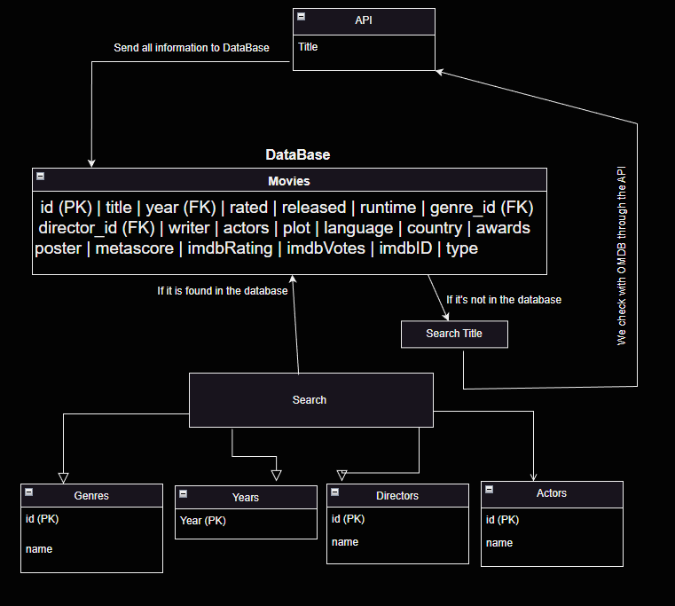

<h1>Robin</h1>

[Trello planering](https://trello.com/b/q8XlSXZp/movies-db)

<h2> Projektrapport: Movies Database </h2>

<h3> Beskrivning av spelet </h3>
Projektrapport: 

<h3> Planering </h3>

<h3> Utveckling </h3>

<h3> Datatyper </h3>

<h3> Vem gjorde vad: </h3>

Aram 

Samer  

Robin 

<h3> Vad kunde ha gjorts bättre: </h3>
Några förbättringar som kunde ha gjorts i projektet är:

<h3> Slutsatser: </h3>

<h3> Backlog </h3>

<h4> Övergripande: </h4>

<h4> Utförligare backlog: </h4>

<h5>Aram</h5>

<h5>Samer</h5>

<h5>Robin</h5>

---------------------------------------------------------------------------

<h3>Beskriv lite olika lösningar du gjort.</h3>

<h3>Beskriv något som var besvärligt att få till.</h3>

<h3>Beskriv om du fått byta lösning och varför i sådana fall.</h3>

<h3>Vad gick bra</h3>

<h3>Vad gick dåligt</h3>

<h3>Vad har du lärt dig</h3>

<h3>Vilka möjligheter ser du med de kunskaper du fått under kursen.</h3>

<h3> Klassdiagram: </h3>

