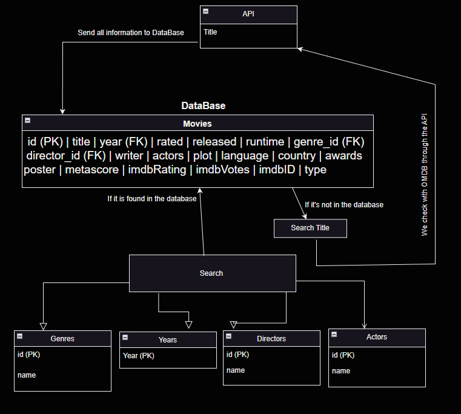

<h1>Samer</h1>

[Trello planering](https://trello.com/b/q8XlSXZp/movies-db)

<h2> Projektrapport: Movies Database </h2>

<h3> Beskrivning av programmet </h3>
Projektrapport: 
Ett program som söker filmer i SQLite databas. Programmet använder 
API för att söka efter filmer om man inte hittar filmen i databasen.

<h3> Planering </h3>

Planeringen var på Trello där vi skrev ner alla uppgifter som behövdes göras och vem som ska göra vad.

<h3> Utveckling </h3>

<h3> Datatyper </h3>

Vi behvde använda oss av olika datatyper som inte och String. Det var String som vi använde mest i projektet, 
för att den har många funktioner som vi behövde i projektet.

<h3> Vem gjorde vad: </h3>

Aram 

Samer  
SQLite klassen och MovieBuilder klassen.

Robin 

<h3> Vad kunde ha gjorts bättre: </h3>
Några förbättringar som kunde ha gjorts i projektet är:
Göra en favorit lista för filmer.
Göra en liten fin GUI för programmet.
Att kunna ha flera sök alternativ via API.

<h3> Slutsatser: </h3>

<h3> Backlog </h3>

<h4> Övergripande: </h4>

<h4> Utförligare backlog: </h4>

<h5>Aram</h5>
Meny och alla diagram.

<h5>Samer</h5>
Hade SQLite klassen och MovieBuilder klassen.

<h5>Robin</h5>
API klassen och Movie klassen.

---------------------------------------------------------------------------

<h3>Beskriv lite olika lösningar du gjort.</h3>

I den klassen jag jobbade med hade jag lite problem med att spara filmer i data basen så jag behövde leta efter en lösning 
i SQL koden som gör att filmer sparas en gång och inte flera gånger.
Sen kom jag och grubben överens att byta till en annan lösning som var enklare och bättre för oss och det är att göra om Menu klassen. 
Jag har spelat ett spel med grubben också och det var att de försöker krasha programmer och jag fixar den och tvärtom.

<h3>Beskriv något som var besvärligt att få till.</h3>

Inget. Jag tycker det gick bra, bara lite problem med git i början och sen gick det bra. 

<h3>Beskriv om du fått byta lösning och varför i sådana fall.</h3>

Jag behövde byta lösning på filmlagring i databasen för att det var bättre att söka i databasen innan man använder sökning via API,
då behöver man inte tänka på att filmer sparas flera gånger i databasen, och man använder API så mindre som möjligt.

<h3>Vad gick bra</h3>

Allt gick bra. Samarbetet, möten, planering, kodning, dokumentation, allt gick mycket bättre än förra projektet.

<h3>Vad gick dåligt</h3>

Lite git problem i början men sen gick det bra. Och det var problem med ganska många klasskamrater.
Så jag var inte själv med problemet.

<h3>Vad har du lärt dig</h3>

Mycket SQL, och mycket mer API grejer. Jag behövde söka ganska mycket efter SQL lösningar.

<h3>Vilka möjligheter ser du med de kunskaper du fått under kursen.</h3>

Jag kan göra mycket mer med SQL och API nu. Jag kan göra mycket mer med databaser.

<h3> Klassdiagram: </h3>

