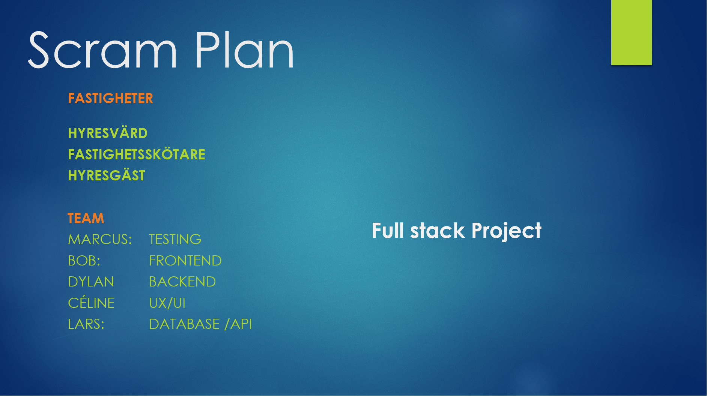
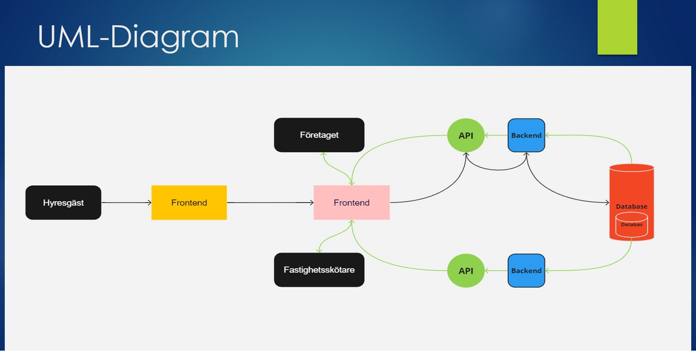

# Backlog

Denna kolumn innehåller alla user stories eller arbetsuppgifter som ännu inte har tilldelats en sprint.

# Sprint Backlog

När du börjar en ny sprint, flyttar du korten från din produktbacklog till din sprintbacklog. Dessa är de arbetsuppgifter som du och ditt team har åtagit er att slutföra under denna sprint.

# In progress

Pågående arbete

# Testing

När en uppgift är klar flyttas den till "Testing" där den granskas och testas för att säkerställa att allt fungerar som det ska.

# Done

# Blocked

Om det finns några uppgifter som inte kan slutföras på grund av något hinder kan de flyttas till "Blocked". Detta gör det tydligt för alla i teamet att det här är något som behöver lösas.

---

## Hantering av Scrum-händelser:

I Scrum finns det flera centrala händelser eller möten som man bör följa. Dessa inkluderar:

### Sprint Planning: 

Detta är ett möte i början av varje sprint där teamet och produktägaren går igenom backloggen och bestämmer vilka user stories som ska inkluderas i den kommande sprinten. Du bör diskutera och komma överens om vilka uppgifter som är prioriterade och vad som är realistiskt att genomföra inom den kommande sprintens tidsram.

### Daily Scrum eller Stand-up:

- 15 minuter. 
- Hur långt man har kommit sedan sist.
- Har man fått hinder?
- Vad skall göra framöver

### Sprint Review: 

Detta är ett möte vid slutet av varje sprint där teamet visar upp vad de har åstadkommit under sprinten. Detta möte kan hjälpa till att ge feedback och justera planer baserat på vad som faktiskt har åstadkommits.

### Sprint Retrospective:

Detta är också ett möte vid slutet av varje sprint, men fokuserar på teamdynamiken snarare än själva produkten. Teamet diskuterar vad som fungerade bra, vad som kan förbättras och kommer överens om några konkreta steg för att förbättra under nästa sprint.

### Sprintmål:

Sprintmålet är en kort, tydlig beskrivning av vad teamet hoppas uppnå under den kommande sprinten. Det bör koppla ihop user stories i sprinten till en övergripande vision för vad teamet vill åstadkomma. T.ex. "Vårt mål för denna sprinten är att implementera funktionaliteten för hyresgäster att rapportera problem till företaget och vaktmästaren.

